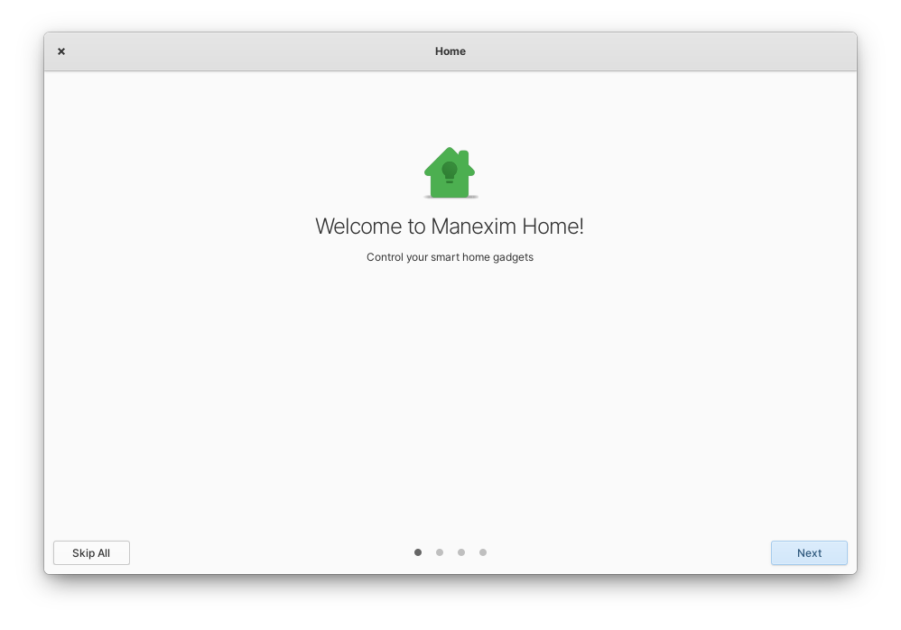
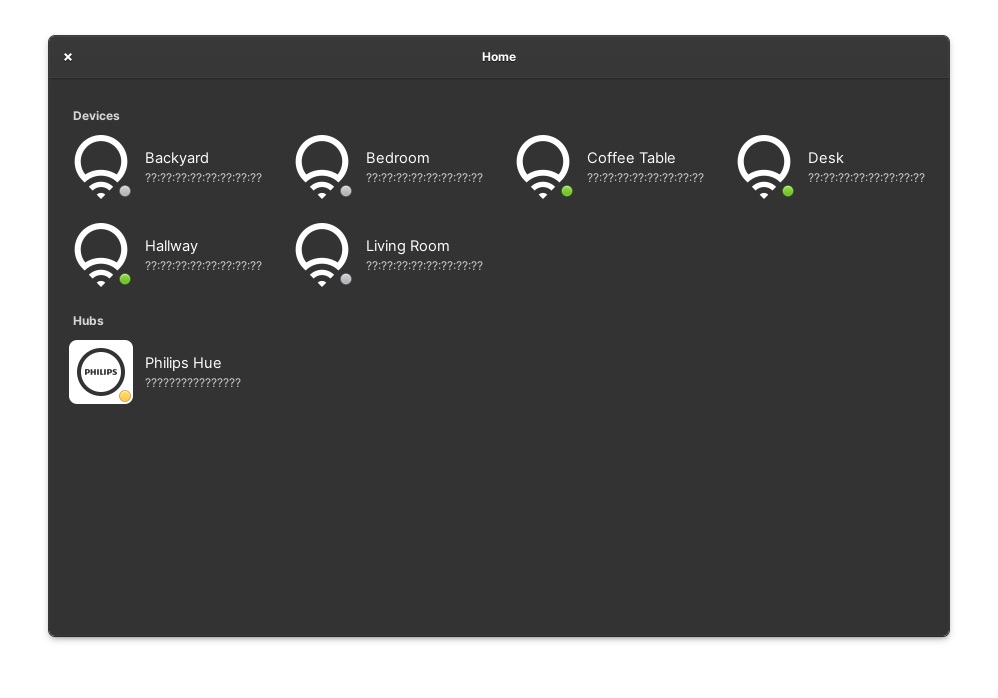
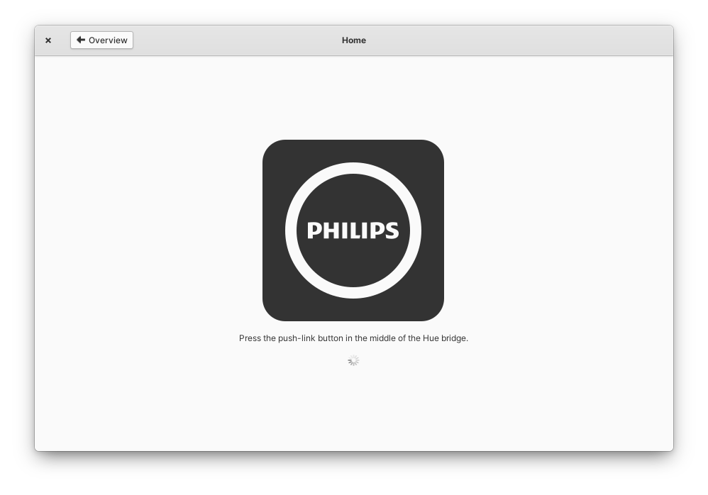
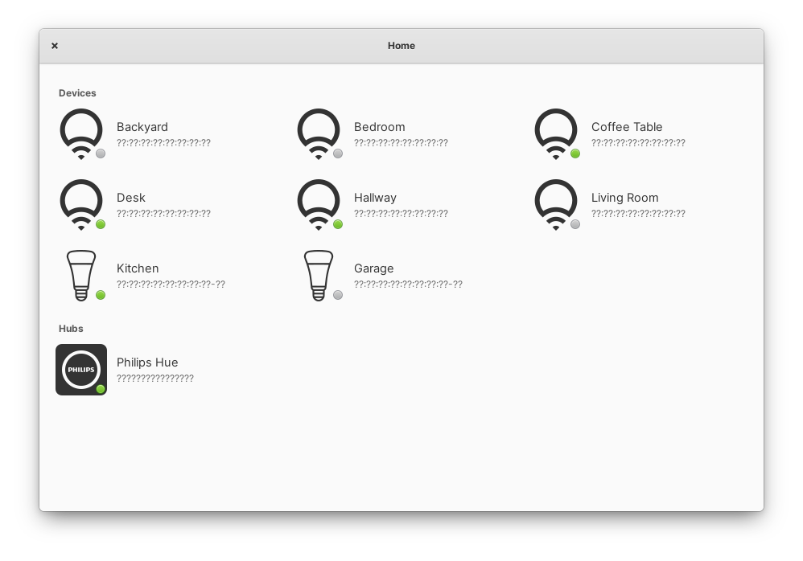

<div align="center">
  <span align="center"> </span>
  <h1 align="center">Home</h1>
  <h3 align="center">Control your smart home gadgets</h3>
  <p align="center">Designed for <a href="https://elementary.io">elementary OS</a></p>
</div>

<p align="center">
  <a href="https://travis-ci.org/manexim/home">
    
  </a>
  <a href="https://github.com/manexim/home/releases/">
    
  </a>
  <a href="https://github.com/manexim/home/blob/master/COPYING">
    
  </a>
</p>







## Installation

### Dependencies
These dependencies must be present before building
 - `elementary-sdk`
 - `meson (>=0.40)`
 - `valac (>=0.40)`
 - `libgtk-3-dev`
 - `libjson-glib-dev`
 - `libgee-0.8-dev`
 - `libgranite-dev`
 - `libsoup2.4-dev`
 - `libxml2-dev`
 - `uuid-dev`

### Building

```
git clone https://github.com/manexim/home.git && cd home
meson build && cd build
meson configure -Dprefix=/usr
ninja
sudo ninja install
com.github.manexim.home
```

### Deconstruct

```
sudo ninja uninstall
```
