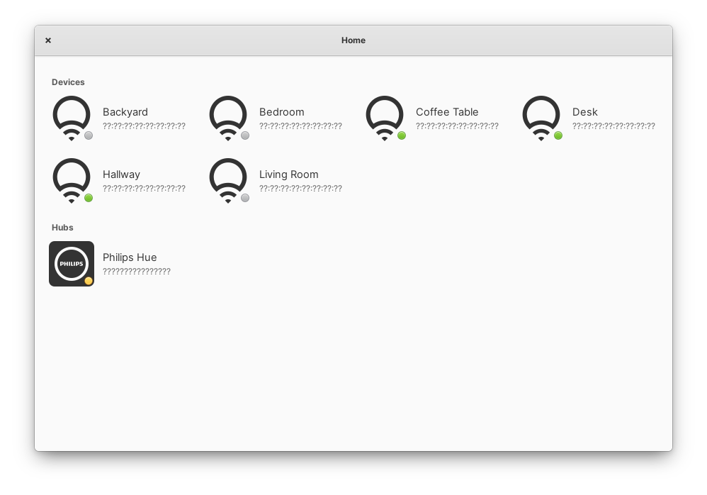

<div align="center">
  <span align="center"> </span>
  <h1 align="center">Home</h1>
  <h3 align="center">Control your smart home gadgets</h3>
  <p align="center">Designed for <a href="https://elementary.io">elementary OS</a></p>
</div>

<p align="center">
  <a href="https://appcenter.elementary.io/com.github.manexim.home" target="_blank">
    
  </a>
</p>

<p align="center">
  <a href="https://travis-ci.org/manexim/home">
    
  </a>
  <a href="https://github.com/manexim/home/releases/">
    
  </a>
  <a href="https://github.com/manexim/home/blob/master/COPYING">
    
  </a>
</p>

<p align="center">
  
  <table>
    <tr>
      <td>
        
      </td>
      <td>
        
      </td>
    </tr>
    <tr>
      <td>
        
      </td>
      <td>
        
      </td>
    </tr>
    <tr>
      <td>
        
      </td>
      <td>
        
      </td>
    </tr>
    <tr>
      <td>
        
      </td>
    </tr>
  </table>
</p>

## Supported devices

<ul>
  <li>LIFX</li>
  <li>Philips Hue</li>
</ul>

## Installation

### Dependencies
These dependencies must be present before building:
 - `elementary-sdk`
 - `meson (>=0.40)`
 - `valac (>=0.40)`
 - `libgtk-3-dev`
 - `libjson-glib-dev`
 - `libgee-0.8-dev`
 - `libgranite-dev`
 - `libsoup2.4-dev`
 - `libxml2-dev`
 - `uuid-dev`

### Building

```
git clone https://github.com/manexim/home.git && cd home
meson build && cd build
meson configure -Dprefix=/usr
ninja
sudo ninja install
com.github.manexim.home
```

### Deconstruct

```
sudo ninja uninstall
```

## Contributing

If you want to contribute to Home and make it better, your help is very welcome.

### How to make a clean pull request

- Create a personal fork of this project on GitHub.
- Clone the fork on your local machine. Your remote repo on GitHub is called `origin`.
- Create a new branch to work on. Branch from `develop`!
- Implement/fix your feature.
- Push your branch to your fork on GitHub, the remote `origin`.
- From your fork open a pull request in the correct branch. Target the `develop` branch!

And last but not least: Always write your commit messages in the present tense.
Your commit message should describe what the commit, when applied, does to the code – not what you did to the code.

## Special thanks

### Translators

| Name                                        | Language      |
| ------------------------------------------- | ------------- |
| [camellan](https://github.com/camellan)     | Russian 🇷🇺    |
| [NathanBnm](https://github.com/NathanBnm)   | French 🇫🇷     |
| [meisenzahl](https://github.com/meisenzahl) | German 🇩🇪     |
| [ryonakano](https://github.com/ryonakano)   | Japanese 🇯🇵   |
| [aimproxy](https://github.com/aimproxy)     | Portuguese 🇵🇹 |
| [oskarkunik](https://github.com/oskarkunik) | Polish 🇵🇱     |

## License

This project is licensed under the GNU General Public License v3.0 - see the [COPYING](COPYING) file for details.
